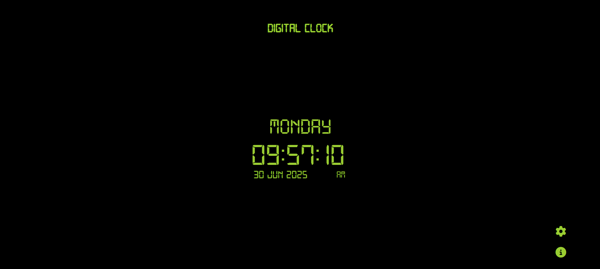

# Digital Clock

A beautiful and responsive digital clock built with HTML, CSS, and JavaScript that displays real-time hours, minutes, seconds, day, and date.

## 🌐 Live Demo

**[View Live Clock](https://digitalcl0ckx.netlify.app/)**

## 📸 Screenshot



## ✨ Features

- **Real-time Updates**: Displays current time with live updates every second
- **12-hour Format**: Shows time in 12-hour format with AM/PM indicator
- **Date Display**: Shows current day and full date
- **Custom Font**: Uses a custom time font for enhanced visual appeal
- **Responsive Design**: Works perfectly on all screen sizes (desktop, tablet, mobile)
- **Modern UI**: Clean and minimalist design with smooth animations
- **Cross-browser Compatible**: Works on all modern browsers

## 🛠️ Technologies Used

- **HTML5**: Semantic markup structure
- **CSS3**: Styling and responsive design
- **JavaScript**: Real-time clock functionality
- **Custom Fonts**: Enhanced typography

## 📁 Project Structure

```
DigitalClock/
├── index.html          # Main HTML file
├── styles.css          # CSS styles and animations
├── script.js           # JavaScript clock functionality
├── fonts/
│   └── time.ttf        # Custom time font
├── screenshot/
│   └── image.png       # Project screenshot
├── icon.png            # Project icon
└── README.md           # This file
```

## 🚀 Getting Started

### Prerequisites

- A modern web browser (Chrome, Firefox, Safari, Edge)
- No additional dependencies required

### Installation

1. Clone or download this repository
2. Open `index.html` in your web browser
3. The clock will start running automatically

### Local Development

1. Navigate to the project directory
2. Open `index.html` in your preferred code editor
3. Make your changes
4. Refresh the browser to see updates

## 🎯 How It Works

The clock uses JavaScript's `Date()` object to get the current time and updates the display every second using `setInterval()`. The time is formatted and displayed in a user-friendly 12-hour format with AM/PM indicators.

## 📱 Responsive Design

The clock is fully responsive and adapts to different screen sizes:
- **Desktop**: Full-size display with optimal spacing
- **Tablet**: Adjusted layout for medium screens
- **Mobile**: Compact design for small screens

## 🤝 Contributing

Feel free to contribute to this project by:
- Reporting bugs
- Suggesting new features
- Submitting pull requests
- Improving documentation

## 📄 License

This project is open source and available under the [MIT License](LICENSE).

## 👨‍💻 Author

Created with ❤️ using HTML, CSS, and JavaScript.

---

**Enjoy your digital clock! ⏰** 
